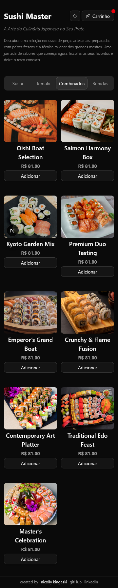
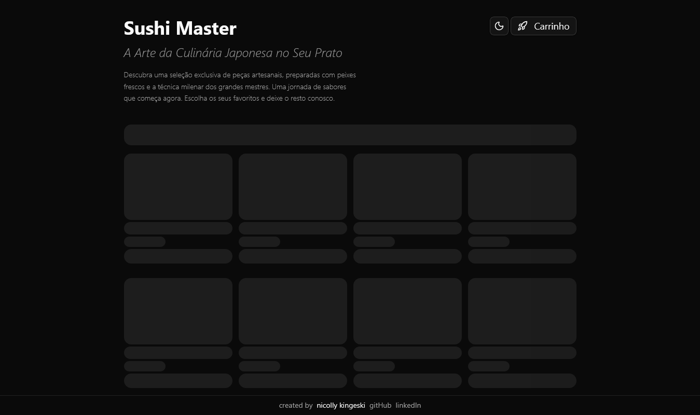
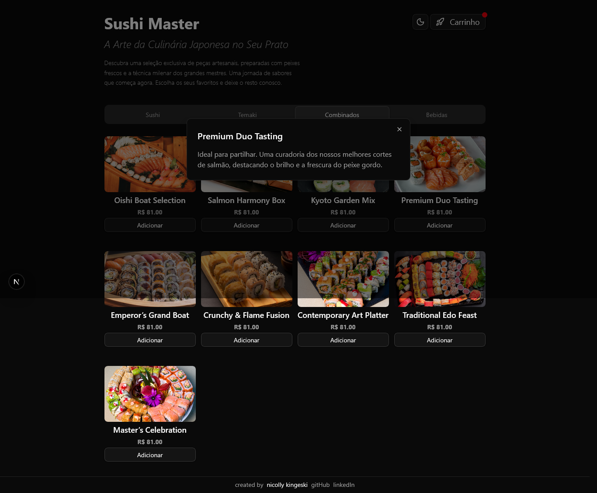
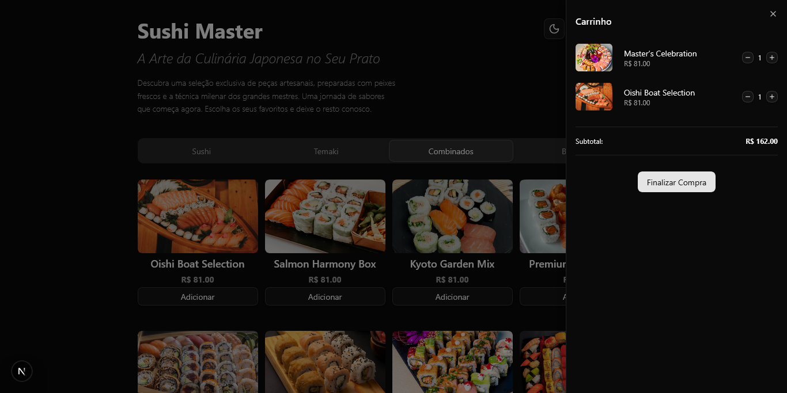

# 🍣 Sushi Master
Sushi Master é uma aplicação web moderna e responsiva para delivery de sushi, desenvolvida com Next.js.  
A aplicação simula um fluxo completo de e-commerce, incluindo listagem de produtos, carrinho de compras e checkout em múltiplas etapas.
Projeto desenvolvido como conclusão acadêmica com foco em arquitetura baseada em componentes, gerenciamento de estado global e boas práticas de UI/UX.

## 🛠️ Tecnologias Utilizadas
- Next.js 13+ (App Router)
- React
- TypeScript
- Tailwind CSS
- Zustand (gerenciamento de estado global do carrinho)
- shadcn/ui (componentes de interface)
- Sonner (notificações toast)
- Zod (validação de formulário)

## ✨ Funcionalidades
- Listagem de produtos por categoria
- Adicionar e remover itens do carrinho
- Estado global do carrinho com Zustand
- Notificações ao adicionar produtos (Sonner)
- Modal de descrição dos produtos (Dialog)
- Formulário de checkout em múltiplas etapas
- Layout totalmente responsivo
- Interface moderna com Tailwind + shadcn/ui

## 🧠 Aprendizados
- Gerenciamento de estado global e persistência de dados com Zustand
- Criação de componentes reutilizáveis e escaláveis
- Implementação de formulários em múltiplas etapas com Zod
- Integração com bibliotecas modernas de UI
- Estruturação de fluxo de e-commerce front-end

## 📸 Screenshots:
### Desktop

### Tablet

### Mobile

### Theme-Toggle

### Skeleton

### Sonner

### Dialog

### Cart

### Checkout

